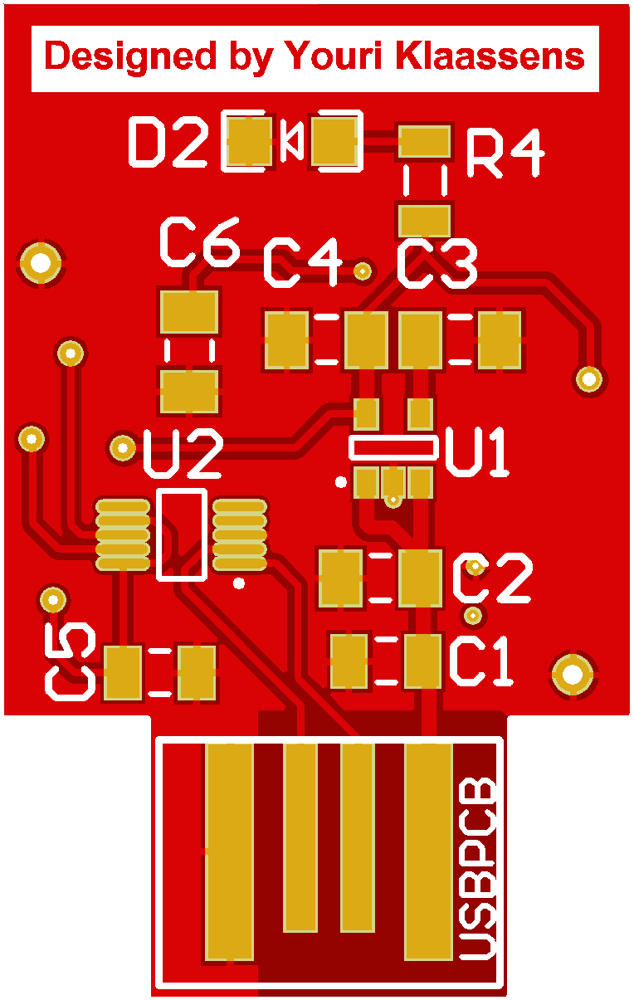
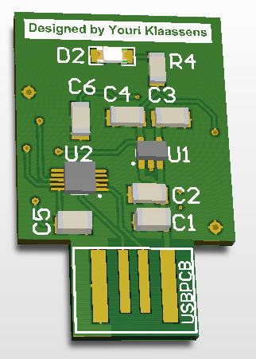
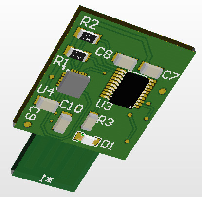
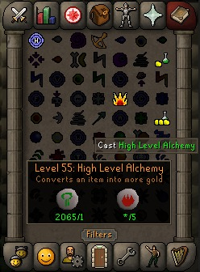
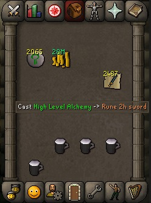

# TRNG_STM8

<!--  -->

 </img>

Computers are hopelessly inadequate when it comes down to random number generation.
They can provide a pseudo random number using a Pseudo Random Number Generator (PRNG).
However, there is a pattern in these pseudo random numbers. Modern Machine learning and AI systems are able to
find this pattern.
The reason why this is problematic is explained later in the section [use case](#Use case)
This repository contains both the software and the hardware files to make a True Random Number Generator (TRNG).

# Table of Contents
1. [Dependencies](#Dependencies)
2. [Renders (PCB)](#Renders)
3. [Use case](#Usecase)

## Dependencies

* `Make`: Used to control the generation of the exetuable
* `sdcc`: This is the compiler defined in the Makefile to compile the source code into an a target object. See [link](http://sdcc.sourceforge.net/)
* `stm8flash`: Tool to flash the target object to the device. See [link](https://github.com/vdudouyt/stm8flash)

Eventually optional dependencies which makes debugging and development easier.

* `stm8-binutils-gdb`: Development toolchain with GNU tools for the STM8 microcontroller. See [link](https://stm8-binutils-gdb.sourceforge.io/)
* `openocd`: Translates the debugging information of a specific target platform to something understandable. See [link](http://openocd.org/)

## Renders

Let's look at the renders from both a top view perspective and a bottom view perspective.
The top view render can be seen in the Figure below.
U1 is the LP2985IM5X-3.3 which regulates the 5V comming from USB to a 3.3V level.
The rest of the system uses the 3.3V source.
U2 is the CH340E USB to UART converter. 

 </img>

The bottom view render can be seen in the Figure below.
U3 is the STM8S103F3P6 microcontroller that contains the code in the `src/` map of this repository.
It is the brain of the system.
U4 is the MPU6050 accelerometer and gyroscope sensor.
The microcontroller communicates to the sensor via I2C protocol.
The pull-up resistors for SDA and SCL are R1 and R2.

 </img>

## Use case

Old school RuneScape is a [MMORPG](https://en.wikipedia.org/wiki/Massively_multiplayer_online_role-playing_game) where a virtual character has skills. Those skills are trainable.
One of the skills is called 'Magic'.
There are multiple ways to train Magic but an easy way is alching items using the High Level Alchemy spell.
If the player sets the item in the correct slot in the invetory the player does not have to move the mouse position.
This means the player only has to press the left mouse key in order to select the spell and then press another mouse click to select the item to alch.
A player using a PRNG to generate random delays between mouse clicks might get banned by the [Botwatch](https://runescape.fandom.com/wiki/Botwatch).
This is a use case where the TRNG is superiour.
Keep in mind that using software to automate actions in the game is [illegal](https://www.runescape.com/game-guide/rules) and I take no responsibilities for damage an individual or group causes after using any content find in this repository.

 </img>

    <em>Magic spell book where the High Level Alchemy spell is the icon with the three yellow dots</em>

 </img>

    <em>The noted Rune 2h sword item is relatively on the same spot as the High Level Alchemy spell</em>

